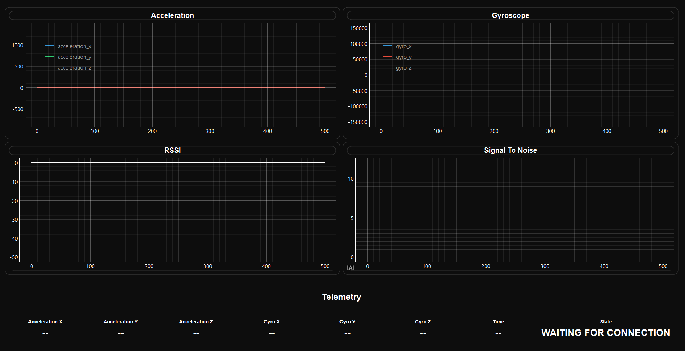
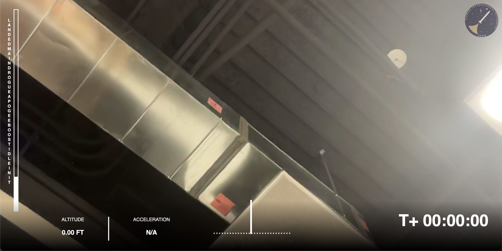

# Orbview

Orbview is a minimalist dashboard system designed to provide real-time data visualization, telemetry monitoring, and seamless integration for aerospace and space exploration projects. It empowers teams to explore new frontiers with confidence and clarity.

## UI Design:




## To Run

```bash
python sensor_dashboard.py
```

## Make EXE file

```bash
python -m PyInstaller --onefile --windowed --icon=dashboard_icon.ico sensor_dashboard.py
```

## Requirements

Needs to have the following:
PyQt6 pyqtgraph numpy pyinstaller

Install with the following:
```bash
pip install PyQt6 pyqtgraph numpy pyinstaller
```

Make sure you have the most recent version of pip by updating:
```bash
python -m pip install --upgrade pip
```

## Commenting Standards

This project uses Python for embedded systems and follows consistent commenting practices to ensure the code is clear, maintainable, and easy to understand.

### 1. Function-Level Comments

- **Format:** Use docstring-style comments (`""" ... """`) before each function.
- **Content:**
  - Briefly describe the function's purpose, parameters, and return values.
  - Use `:param` and `:return` tags to document function inputs and outputs.
  - If there are any known issues, planned work, or bugs, use `TODO(#issueNumber)` or `FIXME(#issueNumber)`.
  - Use `NOTE(name):` for non-actionable observations or temporary conditions.

**Example:**

```python
def read_and_process_sensor(sensor_pin):
    """
    Fetches data from a sensor and processes the result.

    Reads from the specified sensor pin, applies filtering, and returns the
    processed value. This function is non-blocking.

    :param sensor_pin: The Arduino analog pin number where the sensor is connected.
    :return: The filtered sensor reading as an integer.

    NOTE(alice): Currently using a simple moving average filter. See #45 for a discussion on implementing a Kalman filter.
    TODO(#101): Integrate a calibration routine to improve accuracy.
    FIXME(#102): Handle sensor saturation conditions more gracefully.
    """
    # Code implementation
    pass
```

### 2. Single-line Comments (Above or Inline)
- **Format:** Use hash(`#`) for single-line comments
- **Content:**
    - Briefly describe the purpose of the code
    - For inline comments, place them after the code on the same line.

**Example:**

```python
# This is a single-line comment
my_other_variable = 5

my_variable = 10  # This is an inline comment
```

### 3. TODO/FIXME Comments

Use `TODO(#issueNumber)` or `FIXME(#issueNumber)` to mark pending tasks, improvements, or steps to be implemented.

**Conditions:**

- For multi-line `TODO/FIXME` comments, use the docstring style as shown in **Function-Level Comments**.
- For single-line `TODO/FIXME` comments, place them inline.

**Example:**

```python
def calculate_checksum(data):
    """
    Calculates the checksum for a given data array.

    :param data: The input data array.
    :return: The calculated checksum value.
    """
    checksum = 0
    for value in data:
        checksum += value  # TODO(#789): Handle overflow for large data arrays.
    return checksum
```