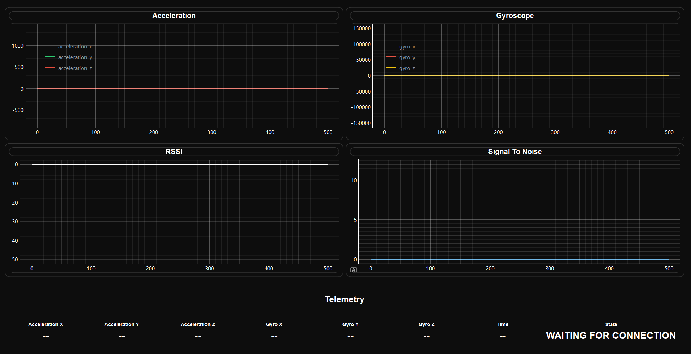

# Orbview (EXE edition)

## To Run

```bash
python sensor_dashboard.py
```

## Make EXE file

```bash
python -m PyInstaller --onefile --windowed --icon=dashboard_icon.ico sensor_dashboard.py
```

## Requirements

Needs to Have the following:
PyQt6 pyqtgraph numpy pyinstaller

Install with following:
```bash
pip install PyQt6 pyqtgraph numpy pyinstaller
```

## UI Design:



